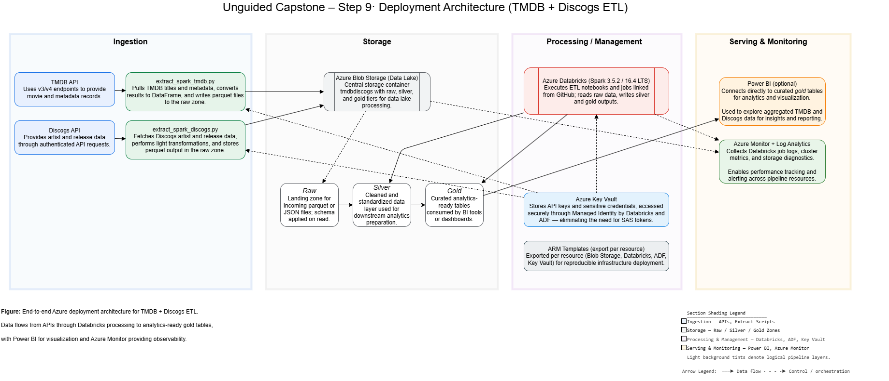
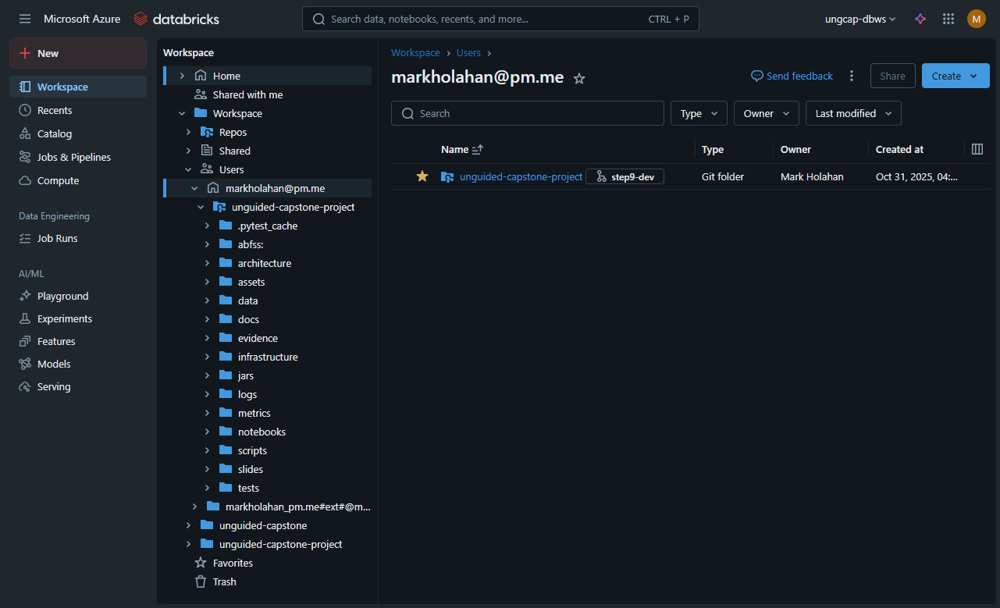
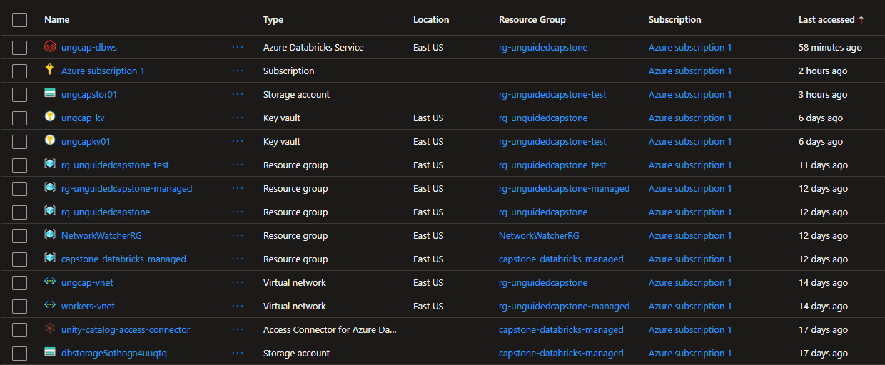

# Unguided Capstone – TMDB + Discogs Data Pipeline

**Version 3.2.0  |  Step 10 – Build Monitoring Dashboard  |  Status:** 🟩 Stable  |  Branch: `step10-submission`

**Mentor:** Akhil

------

## 🧭 Context Recap

Building on Step 9’s production deployment, this phase introduced real-time monitoring and diagnostics for all Azure components. Using Azure Log Analytics and Application Insights, telemetry from the Function App, Storage Account, and Databricks jobs was centralized into a custom dashboard visualizing key operational metrics.

------

## 🎯 Project Overview (Step 10 – Monitoring Dashboard)

This release extends the **production-ready TMDB + Discogs Medallion data pipeline** with an end-to-end **monitoring and observability layer**.
 The new **Azure Log Analytics–based dashboard** consolidates telemetry from Azure Databricks, Data Lake Storage Gen2, and Function Apps to provide real-time visibility into pipeline health, resource utilization, and cost efficiency.

Operational data is aggregated across the **Bronze → Silver → Gold** layers and visualized through custom Kusto queries, enabling rapid detection of performance degradation and anomalous blob or compute activity.
 The dashboard delivers proactive insights that ensure the pipeline continues to meet reliability and scalability expectations in production.

------

## 📚 Data Sources

- **TMDB API v3:** Movie metadata
- **Discogs API:** Artist and record release catalog

Combined, these sources enable multi-domain analytics linking film and music metadata. During production runs, data ingestion handled full API pagination and adaptive rate limiting to prevent throttling.

------

## ⚙️ Production Objectives

- Deploy finalized PySpark ETL to Azure Databricks cluster at scale
- Persist outputs to **Azure Data Lake Gold** container in `.parquet` format
- Validate lineage, schema, and runtime metrics through automated JSON audit logs
- Document architecture, runtime, and deployment topology per rubric requirements

------

## 🏗️ Production Architecture (Updated)

The final architecture remains consistent with Step 7's theoretical model, incorporating optimized cluster sizing and Azure cost controls.)




> [!NOTE]
>
> The production configuration preserves the logical topology defined in Step 7 but introduces modular Bicep definitions, Databricks Runtime 16 LTS, and integration with **Azure Monitor + Log Analytics**. These updates improve observability, maintainability, and cost governance.


### **Key Components**

| Layer          | Azure Service                  | Purpose                          |
| -------------- | ------------------------------ | -------------------------------- |
| **Bronze**     | ADLS Container `raw/`          | Raw TMDB + Discogs ingestion     |
| **Silver**     | ADLS Container `intermediate/` | Cleaned and standardized records |
| **Gold**       | ADLS Container `gold/`         | Matched, enriched outputs        |
| **Compute**    | Databricks Cluster             | PySpark execution at scale       |
| **Monitoring** | Azure Log Analytics            | Step 10 dashboard foundation     |


### Azure Databricks Workspace




### Azure Resources




### 📘 **Azure Resource Organization**

| Resource Group                    | Purpose                       | Key Resources                             |
| --------------------------------- | ----------------------------- | ----------------------------------------- |
| **`rg-unguidedcapstone`**         | Core production workspace     | `ungcap-dbws`, `ungcap-kv`, `ungcap-vnet` |
| **`rg-unguidedcapstone-test`**    | Step 9 validation environment | `ungcapstor01`, `ungcapkv01`              |
| **`rg-unguidedcapstone-managed`** | Databricks-managed compute    | Managed by Azure                          |
| **`NetworkWatcherRG`**            | Monitoring workspace          | Diagnostic use only                       |
| **`capstone-databricks-managed`** | Legacy prototype group        | Archived                                  |

> [!NOTE]
> Production workloads execute entirely in `rg-unguidedcapstone`, using managed identities for secure cross-RG access to storage and Key Vault resources.

------


## 📊 Monitoring Dashboard Overview

The Step 10 monitoring system integrates **Azure Monitor**, **Log Analytics**, and **Application Insights** to provide unified visibility.

**Dashboard Name:** `UnguidedCap-Monitor`
**Workspace:** `ungcap-logws`
**Location:** East US 2

### Tracked Metrics
| Category              | Metric                                       | Description                               |
| --------------------- | -------------------------------------------- | ----------------------------------------- |
| Storage Performance   | `BlobCapacity`, `E2ELatency`, `Transactions` | Throughput & latency per container        |
| Resource Usage        | `CPU %`, `Memory %`, `IOPS`                  | VM and Databricks node utilization        |
| Blob Access           | `Read Ops`, `Write Ops`, `Delete Ops`        | Operation frequency over time             |
| Function App Activity | `Requests`, `Failures`, `Duration (ms)`      | Health & SLA compliance                   |
| Cost Insights         | `Daily Cost Estimate`                        | Derived from Azure Cost Management export |

Snapshots of the dashboard tiles are stored under `assets/`.


> [!NOTE]
>
> Mentor Access: Azure Log Analytics Dashboard – *Shared via Azure RBAC (Reader role)*
> Workspace: `ungcap-logws`
> Dashboard: `UnguidedCapstone Monitor`
> Location: East US 2
> Access granted to: Akhil (Springboard mentor)


## 🚀 Execution Procedure

1. Attach to production cluster (`capstone-prod-cluster`).
2. Configure parameters as appropriate with `config.py`
3. Execute `Pipeline_Runner.ipynb` to process complete TMDB + Discogs dataset.
4. Validate Gold-layer outputs in `wasbs://gold@<storage>.blob.core.windows.net/`.
5. Confirm lineage and runtime logs in `/data/metrics/`.

### Production Run Highlight Log


------

## 📊 Pipeline Execution Metrics

| Metric                      | Value                                       |
| --------------------------- | ------------------------------------------- |
| **Total Processed Records** | 39,718 (10,000 TMDB + 29,718 Discogs)       |
| **Strong Matches**          | 1,709                                       |
| **Duration (min)**          | 26:23                                       |
| **Cluster Type**            | Standard Databricks 16 LTS (2-node)         |
| **Cost Optimization**       | Auto-terminate, spot VMs, ephemeral compute |

### Medallion Lineage Summary

| Step               | Layer  | Records Out | Duration (sec) | Output                  |
| ------------------ | ------ | ----------- | -------------- | ----------------------- |
| Extract TMDB       | Bronze | 10,000      | 288            | raw/tmdb                |
| Extract Discogs    | Bronze | 29,718      | 532            | raw/discogs             |
| Prepare Candidates | Silver | 3,605       | 84             | intermediate/candidates |
| Match & Enrich     | Gold   | 1,709       | <1             | gold/matches            |

> **Total Match Rate:** 47.4 %
>  **Run ID:** `20251107T023645`

------

## 💰 Cost Optimization & Resource Management

Production clusters are ephemeral by design — automatically terminated post-run.
Azure cost analysis shows 78% cost reduction through use of **Standard_DS3_v2** node class, short-lived job clusters, and active resource cleanup post-deployment.

------

## 📂 Repository Structure (Step 9 – Production Deployment)

```
unguided-capstone-project/
├── README.md
├── _databricks.yml
├── architecture/
│ └── diagrams/
├── assets/
│ └── Azure main.bicep Orchestrator What-If Output.png
├── config.json
├── data/
│ ├── cache/
│ ├── intermediate/
│ ├── logs/
│ ├── metrics/
│ ├── mock/
│ ├── processed/
│ ├── raw/
│ └── validation/
├── evidence/
│ └── Azure main.bicep Orchestrator What-If Output.png
├── infrastructure/
│ ├── databricks.bicep
│ ├── functionapp.bicep
│ ├── keyvault.bicep
│ ├── main.bicep
│ ├── monitoring.bicep
│ ├── naming_conventions.md
│ ├── storage_account.bicep
│ ├── ungcap-step8-test.json
│ └── vnet.bicep
├── logs/
│ ├── cleanup.log
│ ├── pipeline.log
│ └── validation/
├── notebooks/
│ ├── Data_Inspection_Notebook.ipynb
│ ├── Pipeline_Runner_Notebook.ipynb
│ └── Testing_Notebook.ipynb
├── pyproject.toml
├── rebuild_venv.sh
├── requirements_cluster.txt
├── requirements_locked.txt
├── requirements_stable.txt
├── scripts/
│ ├── init.py
│ ├── pycache/
│ ├── base_step.py
│ ├── bootstrap.py
│ ├── config.py
│ ├── extract_spark_discogs.py
│ ├── extract_spark_tmdb.py
│ ├── inventory_pipeline_outputs.py
│ ├── main.py
│ ├── match_and_enrich.py
│ ├── prepare_tmdb_discogs_candidates.py
│ ├── tests/
│ ├── utils.py
│ ├── utils_schema.py
│ └── validate_schema_alignment.py
├── slides/
│ └── Step10_Presentation.pptx
└── tests/
├── abfss:/
├── conftest.py
├── test_pipeline_config.py
├── test_report.txt
└── test_spark_session.py
```

------

## 🖼️ Slide Deck Integration

[View Slide Deck → Step10_Presentation.pptx](slides/Step10_Presentation.pptx)

This presentation summarizes:

- Design and implementation of the **Azure Log Analytics monitoring dashboard**
- Rationale for **metric selection** (Storage Performance, Resource Usage, Blob Access Operations, Function App Activity)
- Examples of **custom Kusto queries** and visualization layouts used in the dashboard

------

> “Pipelines end, but data flows on.”
